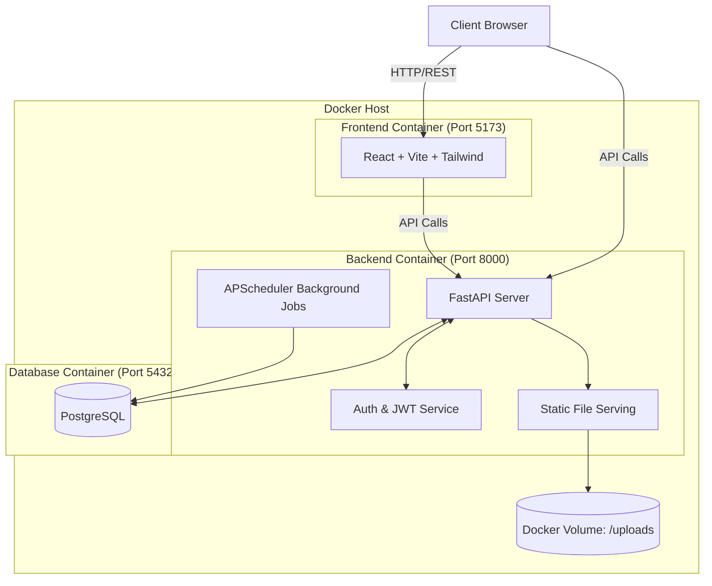

# System & Security Architecture

CertVerify employs a modern, containerized, three-tier architecture with an intense focus on security and data integrity.

## System Architecture

## Security Architecture

1. **Authentication (JWT)**
   - Passwords hashed using `bcrypt` via `passlib`.
   - Access Tokens: Short-lived (15-60 mins).
   - Refresh Tokens: Long-lived (7 days), stored securely and rotated upon use.
   - Frontend: Auto-logout triggered after 15 minutes of inactivity (mouse, keyboard).

2. **Access Control (RBAC)**
   - Roles: `SUPERADMIN`, `ADMIN`, `VIEWER`.
   - `SUPERADMIN` exclusively has the right to delete certificates and trigger DB backups.

3. **Data Integrity Verification**
   - At upload time, a streaming chunk-based SHA-256 hash is generated and stored in the database.
   - At verification time, the file on disk is re-hashed. If the hash does not match the database, the API throws an HTTP 500 error, refusing to verify or serve the file.

4. **Network & API Protection**
   - **Rate Limiting**: `slowapi` enforces strict limits on public endpoints to mitigate DDoS and brute-force guessing of Certificate IDs.
   - **Secure Headers**: Injected via the `secure` middleware (X-Frame-Options, X-Content-Type-Options, CSP, HSTS).
   - **CORS**: Explicitly restricted to known frontend origins.

5. **Audit Trail**
   - Every read (verification) and write (create, update, delete) operation writes to an append-only `AuditLog` table.
   - IP addresses and Actor Usernames are recorded for non-repudiation.
