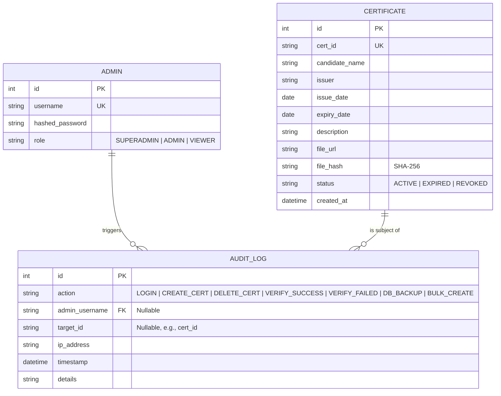

# Entity Relationship Diagram

```mermaid
erDiagram
    ADMIN {
        int id PK
        string username UK
        string hashed_password
        string role "SUPERADMIN | ADMIN | VIEWER"
    }
    
    CERTIFICATE {
        int id PK
        string cert_id UK
        string candidate_name
        string issuer
        date issue_date
        date expiry_date
        string description
        string file_url
        string file_hash "SHA-256"
        string status "ACTIVE | EXPIRED | REVOKED"
        datetime created_at
    }
    
    AUDIT_LOG {
        int id PK
        string action "LOGIN | CREATE_CERT | DELETE_CERT | VERIFY_SUCCESS | VERIFY_FAILED | DB_BACKUP | BULK_CREATE"
        string admin_username FK "Nullable"
        string target_id "Nullable, e.g., cert_id"
        string ip_address
        datetime timestamp
        string details
    }

    ADMIN ||--o{ AUDIT_LOG : "triggers"
    CERTIFICATE ||--o{ AUDIT_LOG : "is subject of"
```
